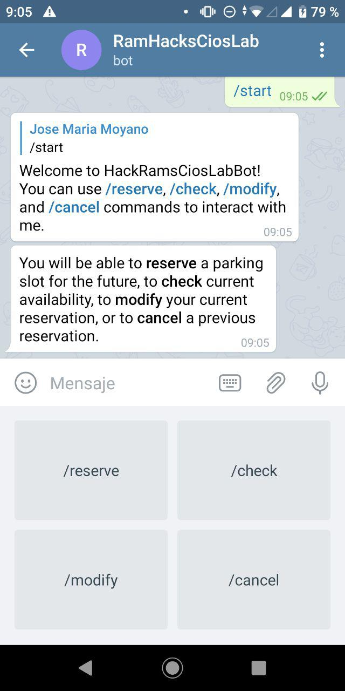
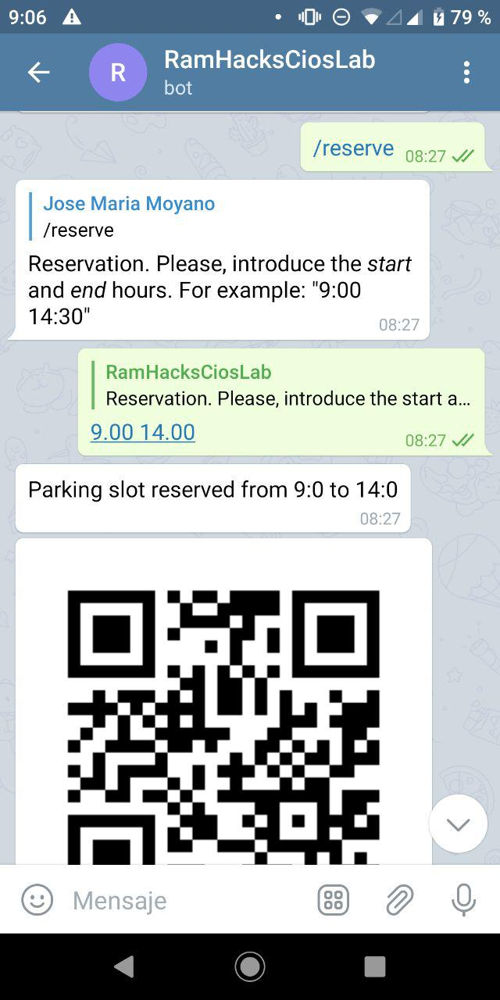
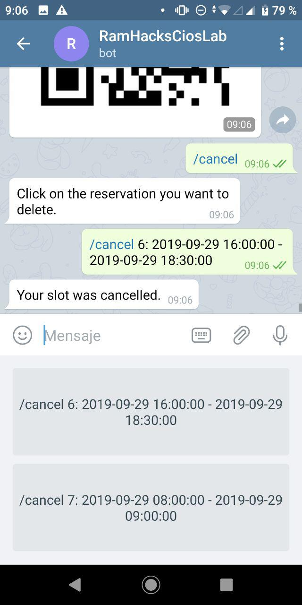

# RamhacksTelegramBot

This bot tries to solve the [challenge](https://ramhacks2019.devpost.com/) of the 'Federal Reserve Bank of Richmond' in RamHacks 2019.
Let's define a parking space with N slots. Some of these slots are usually reserved to employees of the Bank, while the rest are also available for clients. However, many of the parking slots for the employees are free each day, due to meetings in another buildings or other job requeriments, so these slots are unused for the whole (or most part of the) day instead of being available to be used by clients.

We propose a flexible solution for this problem.
* First, we proposed to implement a bot in telegram, so the users of the parking (both employees of the bank and clients) do not need to have another app instaled in their smartphones, but they can use their usual messaging app. This is one of the strengths of our proposal, since it made the process much easier to all users. 
* This bot implements a reservation system for the parking. By default, employees of the bank will have their slots reserved each day in their work hours. However, they are able to modify or cancel their reservations if they know that they are not going to use the slot an specific day or part of them. However, if they do not cancel or modify this reservation, it will be reserved the whole day.
* The clients or regular users of the parking are able to reserve an slot for specific hours, as long as there are available slots for this moment. Also, they are able to check the live avaliability of slots in the parking until a given hour. In any case, if they are given an slot, they will receive a QR code in telegram, which they will use as code to enter and exit from the parking. Further, unless employeers of the bank, if clients do not arrive to the parking a given time frame (i.e., 15 minutes) after their reservation, their slots will be available to be reserved by other users.

Therefore, the main objective is to provide the employees an easy way to modify or even cancel their reservations of slots, but always giving them priority over clients. In this way, we aim to reduce the number of unused parking slots that could be used by clients, increasing their satisfaction and even allowing the company to be able to take advantage of these unused slots by filling them with clients that eventually will pay to park there. 

This bot is interactive and very easy to use. It offers buttons in the screen to guide the process of reserving, modifying, checking availability or cancelling the reservation of a slot. Further, it also could be controlled with commands and keywords, such as **/reserve**, **/modify**, **/check**, and **/cancel**.
* By using the **/start** or **/help** commands, the bot will briefly show its use, as well as present us in the screen the four main actions.
* We can reserve an slot in the parking in the following ways:
  * By clicking on the _/reserve_ button or using the **/reserve** command, the bot will ask us to enter the start and end hours to reserve the slot, reserving one slot for us as long as there are any slot available in the period of time that we introduced. 
  * By typing the keyword **reserve** followed by the start and end hours. For example, we can type "_reserve 8:00 16:00_" to try to reserve an slot from 8:00 to 16:00. The hours can be always specified separated by both "_:_" or "_._", but always in 24h format.
* We can check the availability of slots from now to a given hour in two ways:
  * By clicking on the _/check_ button or using the **/check** command, the bot will ask us to enter the end hour to reserve the slot (beggining from the present), just saying if there are available slots or not in this period of time. Unlike _/reserve_, this command will not reserve any slot; it is designed for clients which are near the parking, in order to know if in this specific moment is there space or not.
  * By using the keyword **check** followed by the hour until we want to check the availability of slots.
* Any user can modify their reservation (either employees and clients) by clicking the _/modify_ button or typing the keyword **modify**; in both cases the operation is the same. The bot will show a list of the reservations of the user, in such a way that the user is able to select one of them to modify it. Once selected, the bot request the user to introduce the new start and end hours for the given reservation, modifying it.
* Finally, any reservation could be cancelled if it is not going to be more longer used. Similarly to the modification, it can be done either clicking on _/cancel_ button or by typign the keyword **cancel**. In both cases, the bot will show to the user its reservations, and the user can select one of them to cancel.

In addition to it, we also include a simple android application to manage the system and the database (not for the final users of the parking). For example, this app is able to read the QR code of each client when they arrive to the parking and therefore is able to control how many spaces are still availables or not in the parking.

This telegram bot has been developed by [Paolo Cachi](https://github.com/PaoloGCD) and [Jose Moyano](https://github.com/i02momuj) for the [Ramhacks 2019](https://ramhacks.vcu.edu), and it is available in Telegram under the name [@RamHacksCiosLabBot](https://t.me/@RamHacksCiosLabBot).
The bot has been implemented in Python, and the database is stored in Google Cloud Platform.

 
	

 
	

 
	

